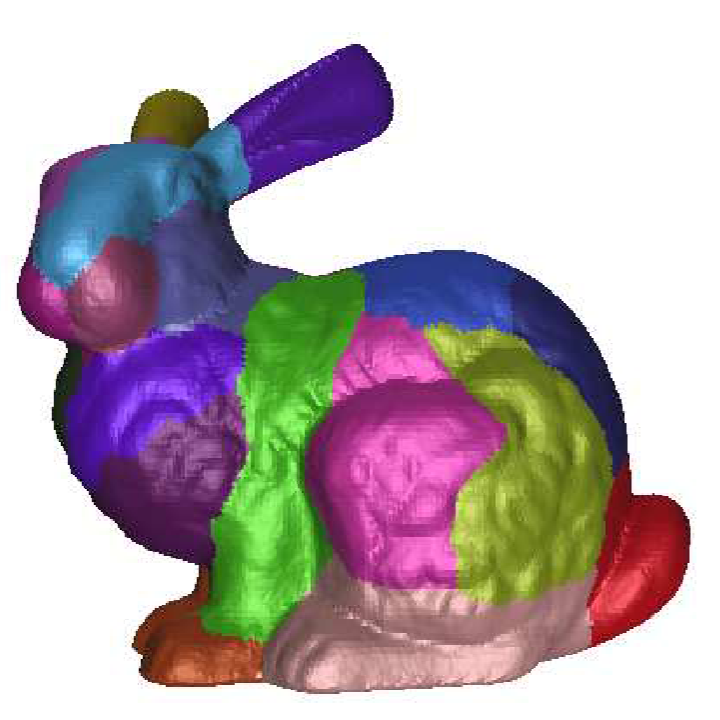

# Watershed Mesh

## Overview

This project applies watershed-based segmentation to 3D triangle meshes, using the Visualization Toolkit (VTK). 
It identifies distinct regions on the surface based on simulated water flow and elevation, and assigns each a unique color.

<p align="center">
  
</p>

## Getting Started

### Development Environment

You can use the provided `flake.nix` to create a Nix environment.
```bash
nix develop
```
This will set up everything needed to start working on the project.

If you are not using Nix, make sure to install:
- CMake >= 3.12
- VTK >= 9.0
- A C++20-compatible compiler

### Build Instructions

Generate the build files with `cmake`.
```bash
cmake -B build
```

Then build the project.
```bash
cmake --build build
```

Finally, run the project.
```bash
./build/watershed-mesh
```

### Debug

You can also specify the build type `Debug` to enable debug symbols and sanitizers.
```bash
cmake -DCMAKE_BUILD_TYPE=Debug -B build
```
